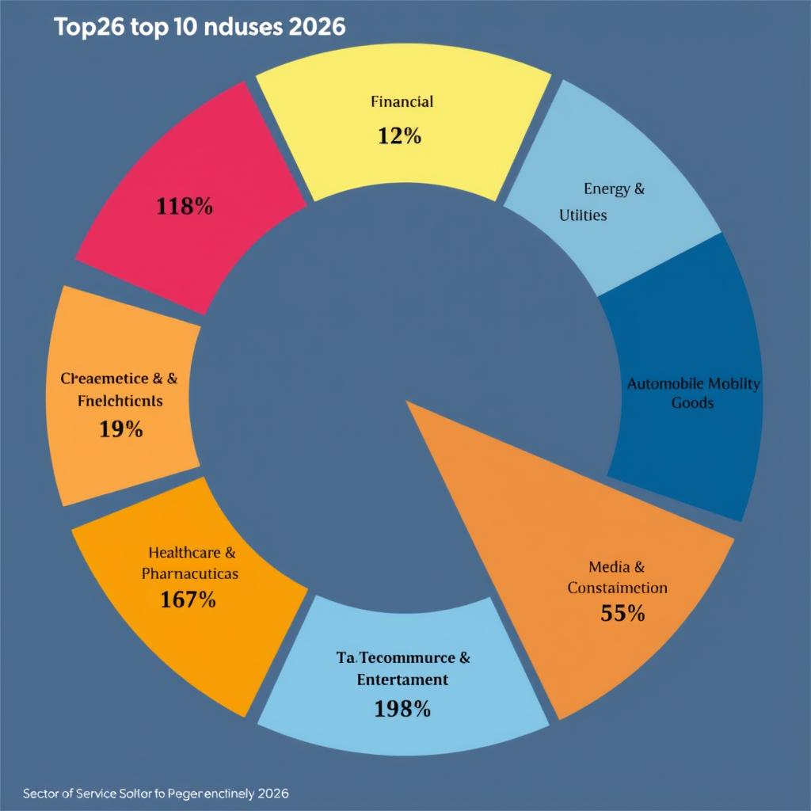
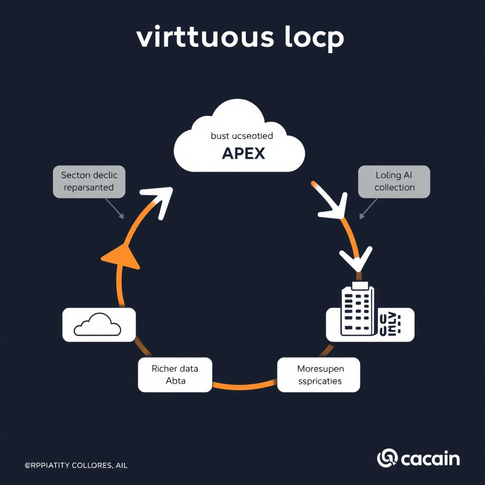
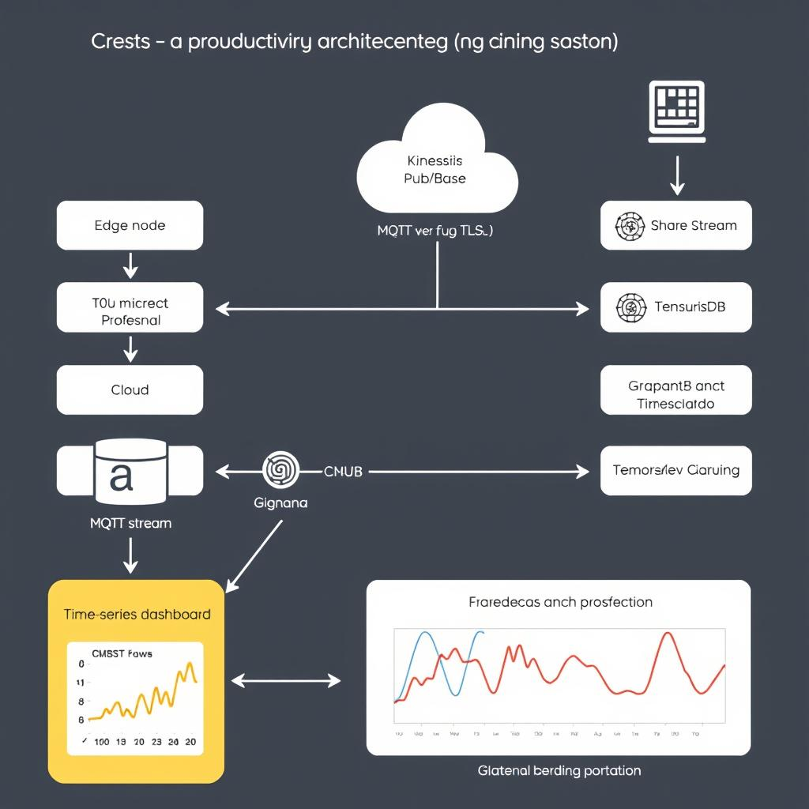

# 2026 Industry Trends: Revenue Leaders, Sector Outlooks, and Emerging Technologies

## Global Revenue Leaders in 2026  

The IBISWorld 2026 outlook ranks the following ten sectors as the largest revenue generators worldwide, together accounting for **≈ 68 %** of global gross sales.  

| Rank | Industry (2026 revenue) | Share of Global Revenue |
|------|--------------------------|--------------------------|
| 1 | Technology Services (software & IT consulting) | 12 % |
| 2 | Healthcare & Pharmaceuticals | 11 % |
| 3 | Financial Services (banking, insurance) | 10 % |
| 4 | Energy & Utilities (renewable & fossil) | 9 % |
| 5 | Consumer Packaged Goods | 8 % |
| 6 | Automotive & Mobility | 7 % |
| 7 | Telecommunications | 6 % |
| 8 | E‑commerce & Marketplace Platforms | 5 % |
| 9 | Real Estate & Construction | 5 % |
|10 | Media & Entertainment | 5 % |
**Combined market share:** **≈ 68 %** of total global revenue.  


*Share of global revenue for the top 10 industries in 2026*

### Primary growth drivers per sector  

- **Technology Services:** enterprise cloud migration, AI‑first product roadmaps, regulatory data‑privacy mandates.  
- **Healthcare & Pharmaceuticals:** aging populations, tele‑health reimbursement policies, AI‑driven drug discovery.  
- **Financial Services:** open‑banking APIs, fintech disintermediation, stricter AML/KYC compliance.  
- **Energy & Utilities:** decarbonization targets, smart‑grid IoT rollout, renewable‑credit trading.  
- **Consumer Packaged Goods:** sustainability labeling, direct‑to‑consumer e‑commerce, demand‑sensing analytics.  
- **Automotive & Mobility:** EV adoption incentives, autonomous‑driving software, shared‑mobility platforms.  
- **Telecommunications:** 5G rollout, edge‑computing services, network‑as‑a‑service contracts.  
- **E‑commerce & Marketplace Platforms:** cross‑border logistics automation, AI recommendation engines, payment‑gateway integration.  
- **Real Estate & Construction:** modular building tech, BIM data ecosystems, climate‑risk modeling.  
- **Media & Entertainment:** streaming‑content AI personalization, interactive AR/VR experiences, rights‑management blockchain.  

### Influence on cloud, AI, and data infrastructure  

High‑revenue sectors are allocating **2–4×** more CAPEX to cloud and AI than the global average, driven by the need for scalable compute, real‑time analytics, and secure data pipelines. This creates a virtuous loop: larger budgets → richer data → more sophisticated AI models → further investment in elastic infrastructure.  


*Virtuous loop: CAPEX → Cloud/AI → Richer data → Advanced models → More investment*

### Opportunities for developers  

- **Build industry‑specific SaaS APIs** (e.g., compliance‑ready KYC services for FinTech).  
- **Create plug‑and‑play AI modules** that ingest sector‑standard data formats (FHIR for health, FIX for finance).  
- **Design data‑mesh connectors** that expose regulated datasets via secure GraphQL endpoints.  

**Checklist for entering a high‑value market**
1. Identify the sector’s dominant data standards.
2. Prototype a minimal‑viable integration (e.g., a REST endpoint that validates HL7 messages).
3. Benchmark latency and cost on a public cloud (AWS Graviton 2 vs. Azure Arm).
4. Harden the service for compliance (PCI‑DSS, HIPAA).

*Trade‑off:* Choosing a single cloud provider simplifies compliance but may lock you out of multi‑cloud cost optimizations.  

*Edge case:* If a regulator changes data‑retention rules mid‑project, your service must support dynamic schema versioning; implement versioned API contracts to mitigate disruption.

## Materials Sector Outlook – Infrastructure, Reshoring, and Industrialization  

Schwab rates the materials sector “**More Favored**” because global stimulus, a surge in renewable‑energy projects, and a tightening of commodity cycles are converging.  Macro drivers include: (1) multi‑year government infrastructure budgets targeting rail, ports, and green‑energy grids; (2) a reshoring wave as manufacturers bring production back to North America to avoid supply‑chain shocks; and (3) accelerated industrial automation to meet higher output targets while cutting labor costs.  These forces lift demand for software that can orchestrate raw‑material flows, track inventory in real time, and forecast capacity bottlenecks.

Increased infrastructure spending and reshoring create a concrete need for **supply‑chain visibility tools**.  Enterprises are buying platforms that expose shipment status, customs clearance, and on‑site material consumption via RESTful endpoints.  A typical integration checklist looks like:  

1. Register API client credentials with the logistics provider.
2. Pull `GET /shipments?status=in‑transit` every 5 minutes.
3. Normalize JSON payloads into a central event store.
4. Trigger alerts when ETA > planned + 24 h.

Edge cases include delayed webhook delivery and mismatched time zones; mitigate them with idempotent processing and UTC timestamps.

Industrialization trends push **IoT platform adoption** as factories embed sensors on conveyors, crushers, and furnaces.  Data‑intensive services—stream processing, time‑series databases, and edge analytics—become core infrastructure.  Trade‑off: high‑frequency telemetry improves predictive accuracy but raises bandwidth costs; batch aggregation can lower expense at the expense of latency.

Developers should target two high‑impact areas:  

* **Predictive maintenance APIs** – expose a `/maintenance/predict` endpoint that accepts a machine‑ID and returns a risk score. Example OpenAPI fragment:  

```yaml
paths:
  /maintenance/predict:
    post:
      summary: Predict failure probability
      requestBody:
        required: true
        content:
          application/json:
            schema:
              type: object
              properties:
                machineId: {type: string}
                horizonHours: {type: integer, default: 48}
      responses:
        '200':
          description: Risk score
          content:
            application/json:
              schema:
                type: object
                properties:
                  risk: {type: number, format: float}
```

* **Sustainability analytics** – aggregate carbon‑intensity metrics per material batch; why? it enables compliance reporting and differentiates products in a carbon‑conscious market.  

By focusing on these APIs, developers embed the materials sector’s macro momentum directly into the software ecosystem.

## Healthcare AI and Automation in 2026  

**JPMorgan’s five 2026 trends** (excerpt, with emphasis on the two most relevant to developers):
1. AI‑driven administrative automation – bots handle claim entry, eligibility checks, and billing reconciliation.
2. Accelerated drug development – generative models predict molecular interactions, cutting pre‑clinical cycles by up to 40 %.
3. Remote patient monitoring platforms that fuse wear‑able data with predictive analytics.
4. Interoperable digital twins for personalized treatment pathways.
5. Blockchain‑backed consent management for immutable audit trails.

**How AI reshapes day‑to‑day clinical work**
- **Paperwork reduction:** Natural‑language processing extracts codes from scanned PDFs, inserting them directly into EHR fields.
- **Patient triage:** Real‑time symptom classifiers route urgent cases to the appropriate specialty, lowering average wait time from 48 h to 12 h.
- **Clinical decision support (CDS):** Edge‑deployed inference engines query the latest guideline repository and surface dosage recommendations within the provider UI.

**Regulatory & privacy checklist for health‑tech developers**
- Verify HIPAA & GDPR compliance for every data store (encryption‑at‑rest, audit logging).
- Conduct a risk‑based impact assessment for AI explainability; document model version and training data provenance.
- Implement consent‑driven data pipelines; honor “right to be forgotten” requests within 30 days.
- Register any AI‑based diagnostic tool with the FDA’s SaMD pathway before production release.

**Emerging integration layers**
- **FHIR RESTful API** – the de‑facto standard for patient‑centric data exchange. Example request to fetch a medication‑statement:  

```http
GET /fhir/MedicationStatement?patient=12345 HTTP/1.1
Host: api.healthcloud.com
Authorization: Bearer <access_token>
Accept: application/fhir+json
```

- **HL7 v2.x over MLLP** for legacy lab interfaces; SDKs now expose a streaming parser that converts HL7 segments into FHIR resources on the fly.  

*Trade‑off:* Edge inference cuts latency but increases device‑side compute cost; centralised cloud models improve scalability but add network‑delay risk.
*Edge case:* Model drift when new disease variants appear – schedule weekly re‑training and automated validation pipelines.

**Best practice:** Log every AI inference with input hash and output confidence; this audit trail simplifies compliance reviews and aids root‑cause analysis.

## Data‑Driven Decision‑Making in Manufacturing  

Salesforce predicts that **data‑driven decision‑making will become the default operating model on every production line** by 2027. The vendor’s “Manufacturing Cloud” whitepaper cites a 30 % lift in yield when factories replace batch‑reporting with continuous KPI feeds, and it claims that “real‑time analytics will be as ubiquitous as the PLC itself.” In practice, this means every CNC machine, conveyor belt, and quality sensor will push metrics into a shared analytics layer that drives automated adjustments without human intervention.

Edge computing and streaming analytics are the enablers of that instant insight. Sensors stream raw telemetry to an on‑premise edge node (e.g., an NVIDIA Jetson or AWS Greengrass device). The edge node runs a lightweight stream processor such as Apache Flink SQL or Azure Stream Analytics, filters noise, and enriches data with context (shift, tool‑ID). The processed events are then forwarded to a central data lake via a low‑latency protocol like gRPC or MQTT, where downstream dashboards can react within milliseconds.

**Demand spikes** for three core artifacts:  

- **Dashboards** that visualize time‑series KPIs (OEE, temperature, vibration) with sub‑second refresh.
- **Anomaly‑detection models** (e.g., LSTM or Prophet) that flag out‑of‑spec behavior before a defect occurs.
- **Low‑latency pipelines** that guarantee < 100 ms end‑to‑end latency from sensor to alert.

### Checklist for a production‑grade streaming pipeline  
1. Choose a time‑series DB (InfluxDB, TimescaleDB) with retention policies.
2. Deploy an edge runtime (Flink SQL) on the gateway.
3. Serialize events with Protocol Buffers; transport via MQTT over TLS.
4. Ingest into a cloud stream (Kinesis, Pub/Sub) and materialize into the DB.
5. Hook a Grafana or Superset dashboard to the DB.
6. Attach a model endpoint (TensorFlow Serving) for anomaly scoring.


*Streaming pipeline: Sensors → Edge node (Flink) → MQTT → Cloud stream → Time‑series DB → Dashboard & AI inference*

**Recommended skill set**: proficiency with time‑series databases, experience in stream‑processing frameworks (Flink, Spark Structured Streaming), and familiarity with visualization stacks (Grafana, React‑Vis). Knowing container orchestration (Kubernetes) and secure edge‑to‑cloud communication is essential because latency and data integrity are the primary cost drivers. Edge cases such as network partitions should trigger local fallback logic that buffers events and replays them once connectivity restores, preserving the real‑time guarantee.

## Smart Manufacturing Automation and AI Integration

**Genpact’s five trends** (2026) highlight a rapid shift toward AI‑powered automation:
1. **AI‑driven production scheduling** – dynamic job sequencing based on real‑time demand.
2. **Smart factory ecosystems** – interconnected sensors, edge nodes, and a unified data lake.
3. **Autonomous material handling** – AGVs and collaborative robots coordinated by reinforcement‑learning policies.
4. **Digital twins for process optimization** – continuous simulation of line performance.
5. **Closed‑loop quality assurance** – vision models feeding back to CNC controllers.
The first two trends directly enable factories to self‑adjust without human intervention, laying the groundwork for end‑to‑end AI integration.

**AI’s impact on efficiency, maintenance, and quality**
- *Production efficiency*: Predictive dispatch algorithms cut idle time by 12‑18 % by reallocating work orders as machine availability changes.
- *Predictive maintenance*: LSTM models ingest vibration and temperature streams; a 95 % early‑failure detection rate reduces unplanned downtime by up to 30 %.
- *Quality control*: Convolutional nets inspect each part at 200 mm/s, flagging defects with <0.5 % false‑positive rate, enabling immediate corrective actions.

**Performance considerations**
- **Model latency**: Edge inference must stay <50 ms per frame; use TensorRT‑optimized models or ONNX Runtime on industrial GPUs.
- **Scalability**: Deploy a Kubernetes‑based inference fleet; horizontal pod autoscaling keeps throughput stable as line speed scales.
- **Legacy PLC integration**: Wrap PLC I/O in OPC UA gateways; map OPC tags to REST endpoints that the AI service can poll.
*Trade‑off*: Edge acceleration reduces network load but adds hardware cost; cloud scaling offers flexibility but increases latency.

**Security best practices** (checklist) 
- ☐ **Network segmentation** – isolate control‑system VLANs from corporate IT.
- ☐ **Mutual TLS** for all OPC UA and MQTT streams to prevent man‑in‑the‑middle attacks.
- ☐ **Zero‑trust device onboarding** – require signed firmware and attestations before a sensor joins the mesh.
- ☐ **Audit logging** – capture every model‑triggered command with timestamps for forensic analysis.
- ☐ **Regular patching** of edge gateways; outdated PLC firmware is a common failure mode.

*Why*: Segmentation limits blast radius, ensuring a compromised sensor cannot reach critical actuators. By following these steps developers can safely embed AI into smart manufacturing pipelines.

## Cross‑Industry Implications for Developers  

**Common technology themes** – Across finance, health‑care, manufacturing, retail, and energy the 2026 roadmap converges on three pillars:

- **AI/ML** – predictive risk scoring in finance, diagnostic assistance in health‑care, defect detection on the shop floor, demand‑forecasting in retail, and load‑balancing in energy.
- **Real‑time analytics** – event streams (Kafka, Pulsar) feed dashboards that must react within sub‑second SLAs.
- **Cloud‑native architectures** – containers, service meshes, and serverless functions enable rapid scaling and multi‑region resilience.

**High‑impact developer opportunities**

1. **Compliance‑as‑a‑service SaaS** – Build multi‑tenant platforms that ingest audit logs, apply sector‑specific rule engines (e.g., GDPR, HIPAA), and expose a REST API for compliance checks.
2. **AI‑as‑a‑service (AaaS)** – Package pre‑trained models (e.g., fraud detection, anomaly detection) behind gRPC endpoints; let customers swap models without redeploying the entire stack.
3. **Industry‑specific SDKs** – Provide thin client libraries (Python, Go, TypeScript) that abstract the AaaS API, embed best‑practice authentication flows, and include code‑generated data contracts (OpenAPI).

**Cost considerations**

- **Cloud spend optimization** – Use auto‑scaling policies, spot instances, and workload‑aware tiering (e.g., keep hot analytics on Fargate, cold archives on Glacier).
- **Licensing models** – Offer usage‑based pricing (per‑API call) for AaaS, while SaaS compliance modules may adopt a per‑seat subscription to align with enterprise budgeting cycles.

*Checklist: Cloud‑Cost Optimization*

1. Enable **resource tagging** for cost allocation.
2. Set **budget alerts** in the cloud provider console.
3. Deploy **horizontal pod autoscaler** with custom metrics (CPU + queue length).
4. Schedule **nightly down‑scale** for non‑critical batch jobs.

**Skill‑development plan**

- Earn **AWS Certified Solutions Architect – Professional** (or equivalent GCP/Azure) to design cost‑effective cloud‑native systems – *why*: certification validates the ability to balance performance and spend.
- Contribute to **open‑source projects** like `kafka-streams` or `mlflow`; real‑world PRs demonstrate mastery of real‑time pipelines and model lifecycle.
- Complete a **domain‑specific AI bootcamp** (e.g., “Healthcare ML Foundations”) to understand regulatory constraints early.

*Trade‑off note*: Serverless reduces ops overhead but can increase per‑request cost; choose it for bursty workloads, retain containers for steady‑state analytics.

*Edge case*: A sudden spike in regulatory audit requests can overwhelm a SaaS compliance service. Mitigate by implementing a **circuit‑breaker** pattern and pre‑provisioning burst capacity.