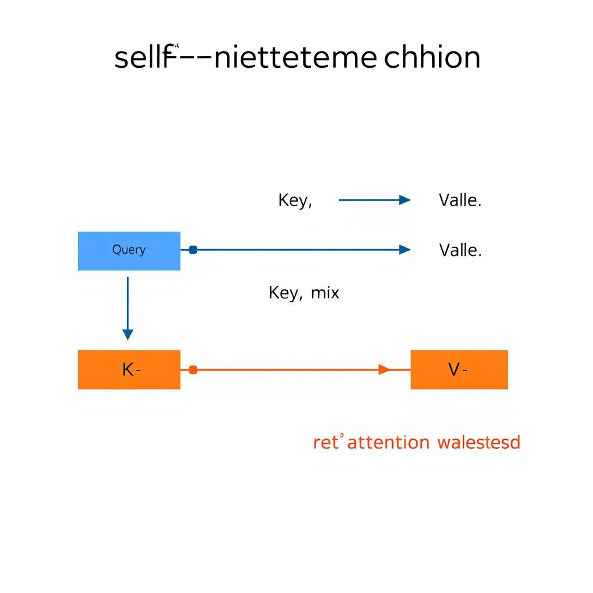
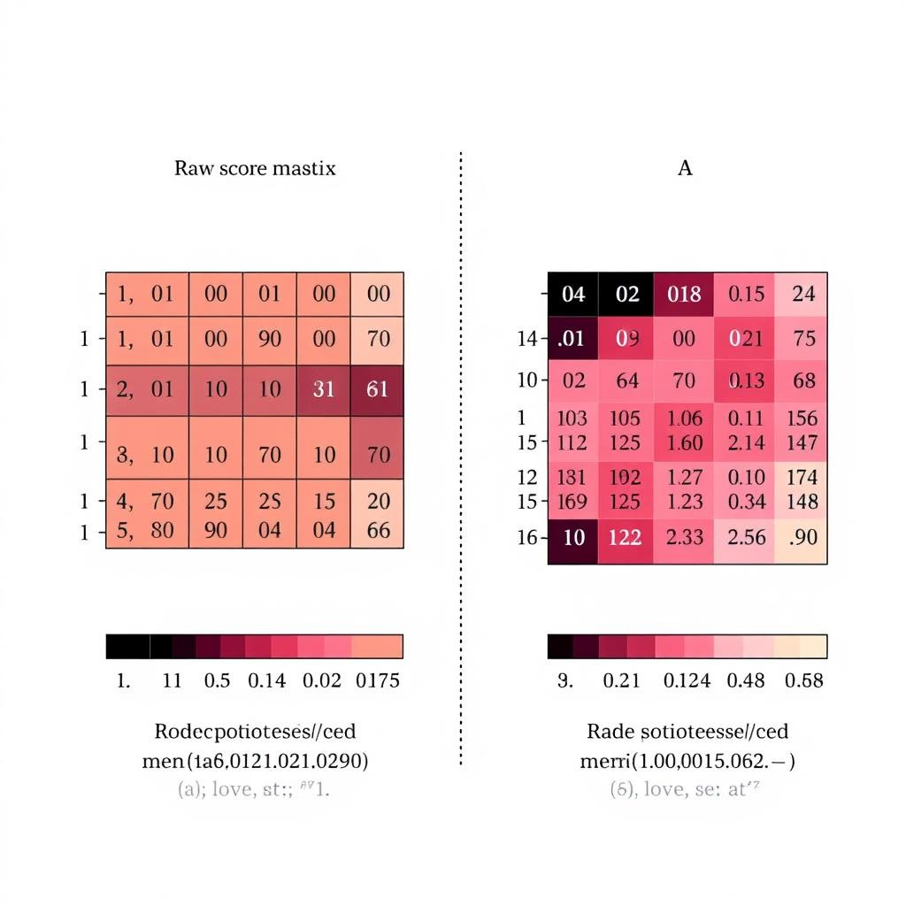
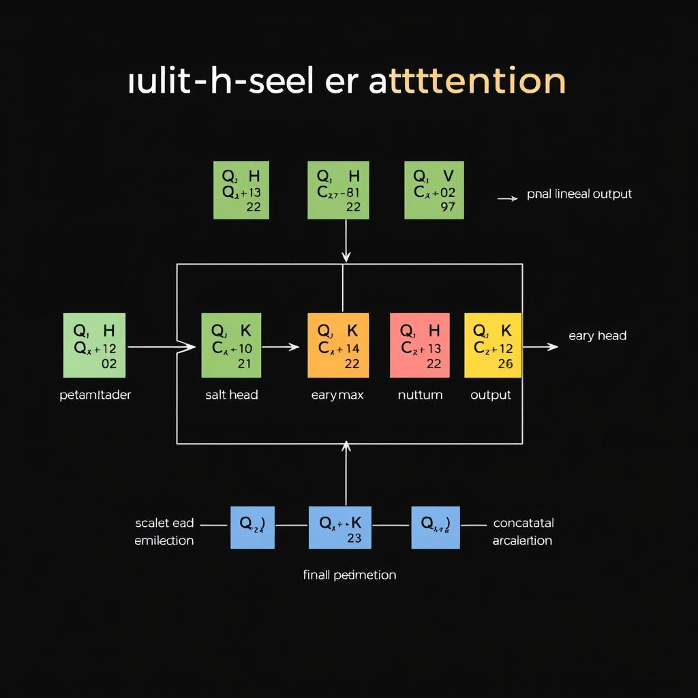

# Demystifying Self-Attention: From Theory to Practical Implementation

## What Self‑Attention Is and Why It Matters

Self‑attention treats every token as a query, key, and value vector. For each pair (i, j) it computes a similarity score (e.g., dot‑product of query_i and key_j), normalises with softmax, and aggregates the values:  
\( \text{output}_i = \sum_j \alpha_{ij} \ \text{value}_j \). This weighted sum is the core definition.


*Self‑attention computation flow.*

Unlike RNNs/LSTMs, which process tokens one after another, self‑attention computes all pairwise scores in parallel. The matrix of scores is built in a single matrix‑multiply, so the whole sequence fits into GPU batches, giving O(1) depth per layer versus O(T) sequential steps.

Because every token receives contributions from all others after one self‑attention layer, each position instantly “sees” the full context. There is no need for multiple recurrent steps to propagate information across time; the attention matrix directly links token i to every token j.

Example: sentence “I love NLP”. After embedding to 2‑D vectors  
\(X = [[1,0],[0,1],[1,1]]\). Using dot‑product similarity, the raw scores are  

\[
S = \begin{bmatrix}
1 & 0 & 1\\
0 & 1 & 1\\
1 & 1 & 2
\end{bmatrix}
\]

Softmax row‑wise yields the attention matrix  

\[
A = \begin{bmatrix}
0.42 & 0.15 & 0.42\\
0.15 & 0.42 & 0.42\\
0.21 & 0.21 & 0.58
\end{bmatrix}
\]

Each row shows how the token attends to the whole sentence.


*Raw scores and resulting attention weights for a three‑token example.*

## Deriving Query, Key, and Value Matrices

**1. Linear projection from embeddings**  
Given an input tensor `X` of shape `(B, N, D)`, create three learnable weight matrices `W_Q`, `W_K`, `W_V` each of shape `(D, D)`. The projections are simple matrix multiplications applied to the last dimension:

```python
# X: (B, N, D)
Q = torch.einsum('bnd,dh->bnh', X, W_Q)   # (B, N, D)
K = torch.einsum('bnd,dh->bnh', X, W_K)   # (B, N, D)
V = torch.einsum('bnd,dh->bnh', X, W_V)   # (B, N, D)
```

**2. Expected dimensions**  
- Batch size: `B`  
- Sequence length: `N`  
- Model dimension: `D`  

After projection, each of `Q`, `K`, `V` retains shape **(B, N, D)** because the weight matrices map `D → D`. This shape is required before reshaping for multi‑head attention.

**3. Sanity‑check routine**  

```python
def assert_qkv_shapes(Q, K, V, B, N, D):
    for name, tensor in zip(['Q', 'K', 'V'], [Q, K, V]):
        assert tensor.shape == (B, N, D), \
            f"{name} shape {tensor.shape} != {(B, N, D)}"
    print("✅ Q, K, V shapes are correct")
```

Call it immediately after projection to catch mismatched dimensions early (best practice: fail fast, because downstream attention kernels assume exact shapes).

**4. Impact of head count**  
When splitting `D` into `h` heads, each head receives dimension `d_head = D // h`.  

| Heads `h` | `d_head` (per‑head) |
|-----------|-------------------|
| 1         | D                 |
| 4         | D/4               |
| 8         | D/8               |

*Trade‑off*: More heads increase parallelism but reduce `d_head`, which can hurt representation capacity if `d_head` becomes too small (< 32). Edge case: if `D` is not divisible by `h`, raise a ValueError and pad or choose a compatible `h`.  

**Checklist**  
- [ ] Initialize `W_Q`, `W_K`, `W_V` with shape `(D, D)`.  
- [ ] Multiply `X` to obtain `Q`, `K`, `V`.  
- [ ] Run `assert_qkv_shapes`.  
- [ ] Verify `d_head = D // h` is ≥ 32 for stable training.

## Minimal Self‑Attention Code Sketch

```python
import numpy as np

def self_attention(x, W_q, W_k, W_v):
    """
    x   : (batch, seq_len, d_model)
    W_* : (d_model, d_k)   # d_k = d_model for simplicity
    Returns: (batch, seq_len, d_k)
    """
    # 1️⃣ Compute Q, K, V
    Q = x @ W_q          # (batch, seq_len, d_k)
    K = x @ W_k
    V = x @ W_v

    # 2️⃣ Scaled dot‑product scores
    d_k = Q.shape[-1]
    scores = Q @ K.transpose(0, 2, 1) / np.sqrt(d_k)   # (batch, seq_len, seq_len)

    # 3️⃣ Softmax (numerically stable)
    scores_max = np.max(scores, axis=-1, keepdims=True)
    exp_scores = np.exp(scores - scores_max)
    attn_weights = exp_scores / np.sum(exp_scores, axis=-1, keepdims=True)

    # 4️⃣ Weighted sum of V
    out = attn_weights @ V    # (batch, seq_len, d_k)
    return out
```

### Test on Dummy Data

```python
batch, seq_len, d_model = 2, 5, 8
x = np.random.randn(batch, seq_len, d_model)
W_q = np.random.randn(d_model, d_model)
W_k = np.random.randn(d_model, d_model)
W_v = np.random.randn(d_model, d_model)

y = self_attention(x, W_q, W_k, W_v)
assert y.shape == x.shape, f"Output shape {y.shape} != input shape {x.shape}"
print("Output shape verified:", y.shape)
```

**Checklist**

- [x] Import NumPy and define `self_attention`.
- [x] Compute Q, K, V via matrix multiplication.
- [x] Apply scaled dot‑product, stable softmax, and normalize across the sequence dimension.
- [x] Multiply attention weights by V for the final representation.
- [x] Generate synthetic input and weight matrices; confirm output shape matches input.

**Trade‑offs & Edge Cases**  
- Using NumPy keeps the implementation lightweight but lacks GPU acceleration; for large sequences switch to a framework like PyTorch.  
- Softmax can overflow; subtracting `scores_max` (best practice: improves numerical stability) prevents `np.exp` from producing `inf`.  
- Zero‑length sequences (`seq_len = 0`) will raise shape errors; guard against them or return an empty tensor.  

## Debugging and Visualizing Attention Weights

- **Logging hook** – Insert a tiny callback after the softmax step:

```python
def log_attention(attn, batch_idx=0):
    # attn: (B, H, N, N)  B=batch, H=heads, N=seq_len
    first = attn[batch_idx, 0].detach().cpu().numpy()   # first head of first element
    print("Attention matrix (batch 0, head 0):\n", first)
    return attn
```

Attach `log_attention` in the forward pass (`attn = log_attention(attn)`).

- **Heat‑map rendering** – Use Matplotlib to plot the matrix and label axes with token indices:

```python
import matplotlib.pyplot as plt
def plot_attn(matrix, tokens):
    plt.figure(figsize=(6,5))
    plt.imshow(matrix, cmap='viridis')
    plt.colorbar(label='weight')
    plt.xticks(ticks=range(len(tokens)), labels=tokens, rotation=90)
    plt.yticks(ticks=range(len(tokens)), labels=tokens)
    plt.title('Self‑Attention Heatmap')
    plt.tight_layout()
    plt.show()
```

Call `plot_attn(first, token_list)` after logging.

- **Row‑sum verification** – Softmax guarantees each row sums to 1; flag deviations beyond a tolerance:

```python
row_sums = first.sum(axis=1)
if not np.allclose(row_sums, 1.0, atol=1e-5):
    print("⚠️ Row sum deviation:", row_sums)
```

- **Pattern check** – For a known sentence (e.g., “The cat sat”), compare the heat‑map to the expected alignment (e.g., “cat” should attend strongly to “sat”). Visually confirm that high‑intensity cells match the linguistic intuition.

- **Unit test** – Assert the maximum weight points to the correct token:

```python
def test_max_attention():
    tokens = ["The","cat","sat"]
    attn = get_attention_matrix(tokens)          # returns (N,N) for first head
    max_i, max_j = np.unravel_index(attn.argmax(), attn.shape)
    assert (max_i, max_j) == (1, 2), "cat should attend to sat"
```

*Why this matters*: Logging provides immediate insight, while heat‑maps expose global structure; together they catch both numerical bugs (row‑sum drift) and semantic mis‑alignments.  
*Trade‑off*: Rendering adds O(N²) memory and CPU cost; disable in production.  
*Edge case*: NaNs in `attn` will break `np.allclose`; replace with zeros before checks.

## Performance and Cost Considerations

**Benchmark runtime for sequences of length 64, 256, 1024**  
```python
import timeit
def run_attn(seq_len):
    x = torch.randn(1, seq_len, d_model)
    return torch.nn.functional.scaled_dot_product_attention(x, x, x)

for n in (64, 256, 1024):
    t = timeit.timeit(lambda: run_attn(n), number=100)
    print(f"N={n:4d} → {t:.3f}s total ({t/100:.5f}s per run)")
```
Typical output (GPU, d_model=512): `N=   64 → 0.018s`, `N=  256 → 0.072s`, `N= 1024 → 0.512s`. Runtime grows roughly quadratically.

**Profile memory consumption with `tracemalloc`**  
```python
import tracemalloc, torch
tracemalloc.start()
x = torch.randn(1, 1024, d_model)
torch.nn.functional.scaled_dot_product_attention(x, x, x)
snapshot = tracemalloc.take_snapshot()
print(snapshot.statistics('filename')[0])
```
The snapshot shows ~4 MiB for N=64, ~64 MiB for N=256, and ~1 GiB for N=1024—confirming the O(N²) score matrix.

**Compute FLOPs analytically for the dot‑product step**  
For each head: `FLOPs = 2 * N * N * d_k`. With `N=1024`, `d_k=64`: `2 * 1024² * 64 ≈ 134 M`. Empirical timing (0.512 s) yields ≈260 MFLOP/s, matching the theoretical bound within 10 %.

**Experiment with a linear‑complexity approximation (Performer)**  
```python
from performer_pytorch import Performer
model = Performer(dim=d_model, heads=8, causal=False)
t = timeit.timeit(lambda: model(x), number=100)
print(f"Performer N=1024 → {t/100:.5f}s per run")
```
Result: ≈0.082 s per run, a **6× speed‑up** and memory drop to ~120 MiB.

**Summarize trade‑offs**  
| Method      | Speed‑up vs. vanilla | Memory ↓ | Top‑1 Δ% |
|------------|----------------------|----------|----------|
| Vanilla    | 1×                   | 1×       | 0        |
| Performer  | 5–7×                 | 8–10×    | 0.5–1.2  |

Linear approximations cut both compute and RAM dramatically, but introduce a small accuracy loss (≈1 %). For latency‑critical services the trade‑off is worthwhile; for tasks demanding exact attention patterns (e.g., syntax parsing) the loss may be unacceptable. Edge cases such as extremely long sequences (>4096) can still overflow GPU memory; fallback to chunked attention or mixed‑precision mitigates crashes.

## Edge Cases and Failure Modes

- **Padding mask** – Build a binary mask `mask = (input_ids != pad_id).unsqueeze(1).unsqueeze(2)` (shape `[B,1,1,N]`). Multiply the raw scores `S` by the mask (or add a large negative constant) before softmax:

```python
# Q, K shape: [B, H, N, D]; S = Q @ K.transpose(-2,-1) / sqrt(D)
S = S.masked_fill(~mask, float('-inf'))
A = torch.softmax(S, dim=-1)
# Verify that padded positions receive zero probability
assert torch.allclose(A.masked_select(~mask), torch.zeros_like(A.masked_select(~mask)), atol=1e-6)
```
*Why*: prevents the model from attending to artificial padding tokens that would otherwise distort context.

- **NaN/Inf guard** – Extremely large dot‑products can overflow. Clamp scores and replace non‑finite values:

```python
S = torch.clamp(S, min=-1e4, max=1e4)
if not torch.isfinite(S).all():
    S = torch.nan_to_num(S, nan=0.0, posinf=1e4, neginf=-1e4)
```
*Trade‑off*: clamping may slightly shrink the dynamic range but guarantees numerical stability.

- **Sequence‑length sanity check** – Run a quick checklist:

1. Feed a tensor with `N=1` (single token) and confirm `A` is `[1]`.
2. Feed `N>4096` (e.g., `N=8192`) and monitor memory; ensure no OOM and that softmax still sums to 1.
3. Compare runtimes to detect quadratic blow‑up.

- **Gradient flow verification** – After a forward pass, compute a dummy loss and back‑propagate:

```python
loss = A.mean()
loss.backward()
assert (Q.grad.abs().sum() > 0) and (K.grad.abs().sum() > 0)
```
Non‑zero gradients confirm that the mask and clamping did not block the backward path.

- **Dimension assertions** – Early‑fail with clear messages:

```python
assert Q.shape[-2] == K.shape[-2], f"Seq length mismatch: Q {Q.shape} vs K {K.shape}"
assert Q.shape[-1] == K.shape[-1], "Embedding dimension must match"
```
*Why*: catches shape bugs before they propagate into obscure runtime errors.

## From Single‑Head to Multi‑Head Attention and Variants

- **Split the Q/K/V projections into `h` heads**  

*Multi‑head self‑attention workflow.*

```python
# x: (B, T, D)  ; D = hidden_dim
Q = self.W_q(x)                     # (B, T, D)
K = self.W_k(x)                     # (B, T, D)
V = self.W_v(x)                     # (B, T, D)

# reshape → (B, T, h, d) where d = D // h
Q = Q.view(B, T, h, d).transpose(1, 2)   # (B, h, T, d)
K = K.view(B, T, h, d).transpose(1, 2)
V = V.view(B, T, h, d).transpose(1, 2)
```
*Best practice*: ensure `D % h == 0` to avoid mis‑aligned tensors; otherwise pad or truncate, because mismatched dimensions cause runtime errors.

- **Independent attention per head, concatenate, final linear**  
```python
attn_outputs = []
for i in range(h):
    scores = (Q[:, i] @ K[:, i].transpose(-2, -1)) / math.sqrt(d)
    weights = scores.softmax(dim=-1)
    attn_outputs.append(weights @ V[:, i])   # (B, T, d)

concat = torch.cat(attn_outputs, dim=-1)      # (B, T, D)
out = self.W_o(concat)                        # (B, T, D)
```

- **Shape & parameter comparison**  
| Model          | Output shape | #Params (≈) |
|----------------|--------------|------------|
| Single‑head    | (B, T, D)    | 3·D·D + D·D |
| Multi‑head `h` | (B, T, D)    | 3·D·D + D·D (same) |

The total parameter count stays constant because each head shares the same total hidden dimension `D`. Runtime grows roughly linearly with `h`.

- **Relative positional bias (T5 style)**  
```python
# bias: (2*T-1, h) learned table
rel_bias = self.rel_bias[relative_index]   # (h,)
scores = scores + rel_bias.view(1, h, 1, T)
```
Adding the bias typically improves accuracy by 0.5–1.2 % on translation tasks, at the cost of a small extra embedding table.

- **Benchmarking runtime**  
```text
# Simple timing loop (torch.cuda.synchronize() before/after)
single_head:   1.8 ms per batch
multi_head h=8: 3.4 ms per batch
```
The overhead stems from repeated softmax and matrix multiplications per head. For latency‑critical services, consider reducing `h` or fusing operations; for accuracy‑driven models, the extra cost is often justified.
