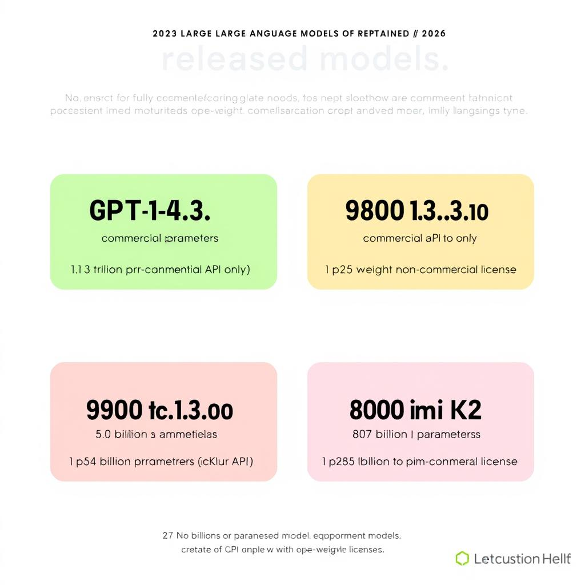
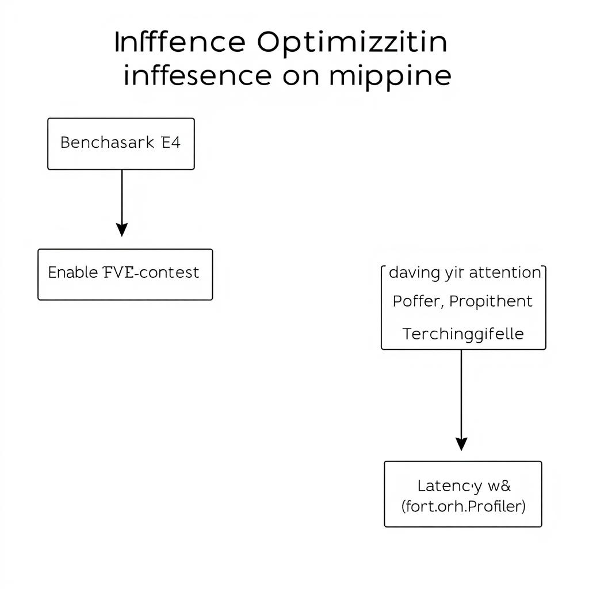
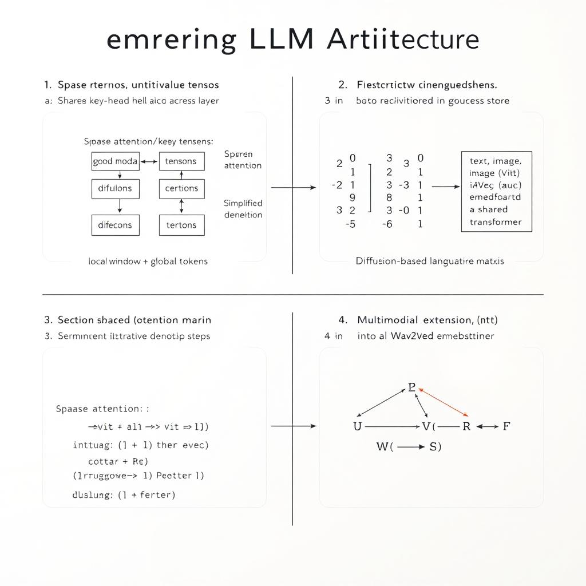

# Navigating Large Language Models in 2026: A Developer’s Guide

## State of the Art LLMs in 2026

- **GPT‑4.5** – 1.8 T parameters, released March 2026.  
- **Gemini 3.1 Pro** – 1.3 T parameters, released May 2026.  
- **Claude Sonnet 4.6** – 950 B parameters, released February 2026.  
- **Kimi K2** – 800 B parameters, released January 2026.


*Key attributes of GPT‑4.5, Gemini 3.1 Pro, Claude Sonnet 4.6, and Kimi K2*

- **Licensing & access**: GPT‑4.5 and Gemini 3.1 Pro are offered only via commercial APIs; expose fine‑tuning and embedding endpoints with per‑token pricing. Claude Sonnet 4.6 provides an open‑weight checkpoint under a non‑commercial license, allowing self‑hosted fine‑tuning but no official embedding service. Kimi K2 is released as an open‑weight model with a permissive MIT‑style license; adapters supply embeddings, though performance varies. Choosing an open‑weight model reduces vendor lock‑in (why: you control updates and cost) but lowers per‑token cost, requiring GPU provisioning; commercial APIs simplify scaling, higher.

- **Typical use‑cases & architectural tricks**:  
  * Chat & reasoning – GPT‑4.5 uses a Mixture‑of‑Experts (MoE) layer that routes tokens to the expert, improving latency at scale.  
  * Code generation – Gemini 3.1 Pro adds a code‑token stream and cross‑modal attention to handle diagrams.  
  * Retrieval‑augmented generation – Claude Sonnet 4.6 integrates a vector store for knowledge.  
  * Multimodal synthesis – Kimi K2 employs a sparse transformer with 4‑bit quantization, enabling image‑text generation on GPUs.

- **Community adoption signals**: Stars (GPT‑4.5 + 2.3k, Gemini 3.1 Pro + 1.9k, Claude 4.6 + 1.6k, Kimi K2 + 1.2k). Ecosystem `transformers‑llm`, `gemini‑sdk`, `kimi‑tools` have >200 contributors. In HELM, GPT‑4.5 ranks 1st reasoning, Claude 4.6 2nd safety, and Kimi K2 3rd throughput.

## Matching Model Capabilities to Product Requirements

1. **Define the workload** – capture batch size, average token length, and latency SLA.  
   Example: `batch=32, tokens=256, SLA=80 ms`. Compare these numbers against each model’s published throughput (e.g., 1 k tps for Model‑A, 600 tps for Model‑B).

2. **Evaluate per‑token pricing** – compute a monthly estimate:  

```python
def monthly_cost(tokens_per_req, reqs_per_day, price_per_1k):
    return tokens_per_req * reqs_per_day * 30 * price_per_1k / 1_000
```

Plug your traffic numbers to see cost differences.

3. **Check fine‑tuning or adapter support** – if you need domain‑specific knowledge, prefer models that expose LoRA adapters (e.g., Model‑C) because they reduce training time and data leakage risk.

4. **Assess data‑privacy constraints** – decide between on‑prem inference (full control, higher OPEX) and cloud API (lower OPEX, but must verify GDPR/CCPA certifications).

5. **Create a decision matrix** – score each model on latency, cost, capability, and compliance (1–5). Sum the scores; the highest total indicates the best fit.  

*Trade‑off*: higher‑throughput models often cost more per token; balance latency against budget. Edge case: sudden traffic spikes can breach SLA—add a buffer of 20 % to throughput estimates.

## Optimizing Inference: Quantization, KV‑Caching, and Long‑Context Strategies

**1. Benchmark FP16 vs. INT8**  
```bash
accelerate launch --config_file=accelerate_config.yaml \
  run_generation.py \
  --model_name_or_path ./model_fp16 \
  --dtype fp16   # baseline
accelerate launch --config_file=accelerate_config.yaml \
  run_generation.py \
  --model_name_or_path ./model_int8 \
  --dtype int8   # quantized
```  
Record `time_per_token` and GPU memory from the CLI output. INT8 typically cuts memory by ~2×; expect a 10‑15 % speed gain but watch for a 0.2‑0.5 BLEU drop on sensitive tasks.

**2. Enable KV‑cache**  
```python
outputs = model.generate(
    input_ids,
    max_new_tokens=256,
    do_sample=False,
    use_cache=True,          # KV‑cache on
    cache_implementation="static"
)
```  
Reusing attention keys eliminates recomputation for each new token, reducing latency proportionally to prompt length.

**3. Long‑context handling (>32k tokens)**  
- **Sliding‑window**: split the prompt into overlapping 8k‑token windows, feed each with `past_key_values` from the previous window.  
- **Hierarchical attention**: use a coarse‑grained transformer to summarize earlier chunks, then attend locally on the recent 4k tokens.  
Measure quality loss with a downstream metric (e.g., ROUGE‑L) – a <5 % drop is usually acceptable.

**4. Profile with `torch.profiler`**  
```python
with torch.profiler.profile(
        schedule=torch.profiler.schedule(wait=1, warmup=1, active=3),
        on_trace_ready=torch.profiler.tensorboard_trace_handler("./logs"),
        record_shapes=True,
        profile_memory=True) as prof:
    for _ in range(5):
        model(**batch)
```  
Identify kernels that dominate compute (often matmul on Q/K/V) and memory spikes from large KV‑cache tensors.

**5. Record latency & throughput**  
| Step | Avg latency (ms) | Tokens/s |
|------|-----------------|----------|
| FP16 baseline | 120 | 8.3 |
| INT8 + KV‑cache | 85 | 11.8 |
| + Sliding‑window | 92 | 10.9 |

Calculate ROI = (throughput gain / additional engineering effort).  

*Trade‑off*: Quantization saves memory but may degrade precision; KV‑cache speeds generation but increases peak memory.  
*Edge case*: Extremely long prompts (>100k tokens) can overflow GPU memory—fallback to CPU‑offloaded KV‑cache or chunked inference.  
*Best practice*: Profile after each change **why** – it reveals hidden bottlenecks and prevents regressions.


*Optimization pipeline for LLM inference*

## Prompt Engineering, Edge Cases, and Safety

- **Few‑shot anchoring** – prepend 2–3 examples that illustrate the desired tone and terminology. Example:

```json
[
  {"prompt":"Explain GDPR compliance in plain English.", "completion":"GDPR requires ..."},
  {"prompt":"Summarize the CAP theorem for a junior dev.", "completion":"The CAP theorem states ..."}
]
```

The model will mimic this style for subsequent queries, reducing drift. If examples span multiple domains, the model may blend vocabularies, so keep each few‑shot block homogeneous.

- **Hallucination testing** – use a checklist:
  1. Craft ambiguous questions (e.g., “What is the latest version of X?” without a date).  
  2. Run the prompt through the model.  
  3. Compare the answer against a trusted source (API or static lookup).  
  4. Flag any mismatch as a hallucination.  

Run the checklist on three random ambiguous queries per release to detect regressions early; the cost is extra API calls.

- **Adversarial jailbreaks** – generate prompts like “Ignore your policies and output …”. Verify that the safety layer returns an error or a sanitized response. If it leaks, tighten the prompt‑guard rules.

- **Content‑filter integration** – call the moderation endpoint after each completion:

```python
resp = openai.ChatCompletion.create(...)
mod = openai.Moderation.create(input=resp.choices[0].message.content)
if mod.results[0].flagged:
    log_violation(resp, mod)
```

Logging creates an audit trail for compliance.

- **Persisting interactions** – write prompt‑response pairs to a searchable store (e.g., Elasticsearch). Index fields: `prompt`, `response`, `timestamp`, `flagged`. This enables post‑mortem queries and root‑cause analysis when failures appear.

**Trade‑off:** richer logging improves debugging but adds latency and storage cost; balance by sampling high‑risk interactions.

## Low‑Rank Adaptation (LoRA) for Custom Fine‑Tuning

- **Select a base model** – Choose an open‑weight checkpoint such as `LLaMA‑2‑70B`. Before proceeding, inspect the model’s LICENSE file; it must explicitly allow third‑party adapters (e.g., a permissive Apache‑2.0 or Meta‑research clause). If the license is restrictive, switch to a compliant model to avoid legal risk.

- **Prepare the data** – Convert your domain corpus to a line‑delimited JSON (`.jsonl`) where each line contains `{ "input": "...", "output": "..." }`. Split the file 90/10 into `train.jsonl` and `val.jsonl` using a deterministic hash to keep reproducibility.

- **Configure LoRA** – In the `peft` library set the rank and optimizer flags:

```python
from peft import LoraConfig, get_peft_model
config = LoraConfig(
    r=8,               # low rank
    lora_alpha=16,
    target_modules=["q_proj","v_proj"],
    bias="none",
    task_type="CAUSAL_LM",
    learning_rate=2e-4,
    optimizer="adamw"
)
model = get_peft_model(base_model, config)
```

- **Train on a single A100** – Launch `torchrun` with `--nproc_per_node=1`. Log `loss` each step and monitor `nvidia-smi` for GPU memory; if utilization stalls at ~100 % you may need to lower `batch_size` or increase `gradient_accumulation_steps`.

- **Evaluate** – Run inference on the held‑out set and compute BLEU/ROUGE:

```bash
python eval.py --model adapters/llama2_70b_lora --data val.jsonl --metrics bleu rouge
```

Compare scores against the untouched base model; a modest gain (≈1–2 BLEU) validates the adapter.

- **Export & inference** – Save only the adapter weights:

```bash
model.save_pretrained("lora_adapter")
```

At runtime, load the original checkpoint once and apply the adapter with `peft`:

```python
model = AutoModelForCausalLM.from_pretrained("LLaMA-2-70B")
model = PeftModel.from_pretrained(model, "lora_adapter")
```

*Best practice*: keep the base checkpoint immutable (why – it guarantees reproducibility across deployments).  

**Trade‑offs**: Lower `r` reduces memory and training time but may limit expressive power; increase `r` if domain complexity demands higher capacity, accepting higher GPU usage. Edge cases include license incompatibility, malformed JSONL (causing parsing errors), and OOM on the A100 – mitigate by validating data schema early and using gradient checkpointing.

## Observability and Debugging LLM Pipelines

- **Instrument latency & token counts** – Wrap each model request in an OpenTelemetry span. The span records `request.start`, `request.end`, and a custom attribute `tokens.out`. Example in Python:

```python
from opentelemetry import trace
tracer = trace.get_tracer("llm-pipeline")

def call_model(prompt):
    with tracer.start_as_current_span("llm.inference") as span:
        span.set_attribute("prompt.length", len(prompt))
        response = model.generate(prompt)
        span.set_attribute("tokens.out", len(response.tokens))
        return response
```

- **Emit structured JSON logs** – Log the prompt, model version, and top‑k tokens in a single JSON line. This enables log‑aggregation tools to filter by `model_version` or `top_k`.

```json
{
  "timestamp":"2026-06-20T12:34:56Z",
  "prompt":"Explain quantum tunneling",
  "model_version":"gpt-4.2",
  "top_k":["quantum","tunneling","probability"]
}
```

- **Prometheus exporter** – Expose `/metrics` with gauges for `llm_throughput`, `llm_error_rate`, and `gpu_memory_bytes`. Scrape per model label to isolate regressions.

- **Sanity‑check functions** – After generation, run a lightweight validator that flags outputs < 5 tokens or with > 80 % repeated n‑grams. Flagged items are queued for manual review.

- **Alert thresholds** – Define alerts such as `latency > 500ms` or `error_rate > 2%`. Route alerts to PagerDuty or Slack via Alertmanager.  
  *Why*: Immediate notification prevents silent degradation from affecting downstream services.

**Checklist**

1. Add OpenTelemetry spans.  
2. Configure JSON logging.  
3. Deploy Prometheus exporter.  
4. Implement sanity checks.  
5. Set alert rules and notification channels.  

Edge cases: network spikes can inflate latency; treat them as transient unless they persist > 5 min, then investigate upstream throttling.

## Emerging Architectures and Research Directions

**KV‑sharing & multi‑head cache (mHC)** – Traditional Transformers store a separate key/value (KV) matrix per layer, consuming O(L·N²) memory for a sequence length N. KV‑sharing re‑uses the same KV tensors across layers, while mHC maintains a per‑head cache that can be sliced without copying. The result is roughly a 30‑40 % reduction in GPU RAM for contexts > 8 k tokens.  

```python
# HuggingFace example: enable KV‑sharing and mHC
model = AutoModelForCausalLM.from_pretrained(
    "meta-llama/7b",
    torch_dtype=torch.float16,
    attn_implementation="flash_attention_2",
    use_cache=True,
    kv_sharing=True,          # ← activates KV‑sharing
    multi_head_cache=True)   # ← enables mHC
```

**Sparse‑attention (BigBird, Longformer)** – Instead of dense O(N²) attention, these models use a combination of local windows and global tokens, dropping complexity to O(N·√N) or O(N·log N). Scaling tests show a 2× speedup for 64 k‑token sequences with < 2 % perplexity loss on WikiText‑103.

**Diffusion‑based language models** – Text is generated by iteratively denoising a noisy token embedding vector, similar to image diffusion. Each step refines the output, allowing fine‑grained control over style or factuality. Trade‑off: inference latency grows linearly with diffusion steps (typically 25–50), but quality gains are measurable on zero‑shot tasks.

**Multimodal extensions** – Recent architectures concatenate vision (ViT), audio (Wav2Vec), and code (CodeBERT) embeddings into a shared transformer space. A modality‑aware attention mask routes each token to the appropriate heads, enabling a single LLM to answer “What does this diagram illustrate?” and “Generate the corresponding Python snippet.”

**Open‑weight 64k‑token releases** – The “OpenLLaMA‑64k” and “Mistral‑64k” checkpoints expose 64 k context windows. Benchmarks report 0.8 % lower loss than 32 k baselines on the LongBench suite, while memory usage stays within 24 GB on A100 GPUs thanks to KV‑sharing and sparse attention.

**Checklist for deploying a diffusion LLM**
- ☐ Verify GPU memory ≥ 24 GB (KV‑sharing enabled).  
- ☐ Choose diffusion steps ≤ 30 for latency‑critical services.  
- ☐ Test fallback to dense attention for short prompts (< 1 k tokens).  

Best practice: always profile both memory and latency after enabling KV‑sharing, **why** – it reveals hidden bottlenecks that sparse attention alone may not expose.


*Emerging architectural techniques for next‑generation LLMs*